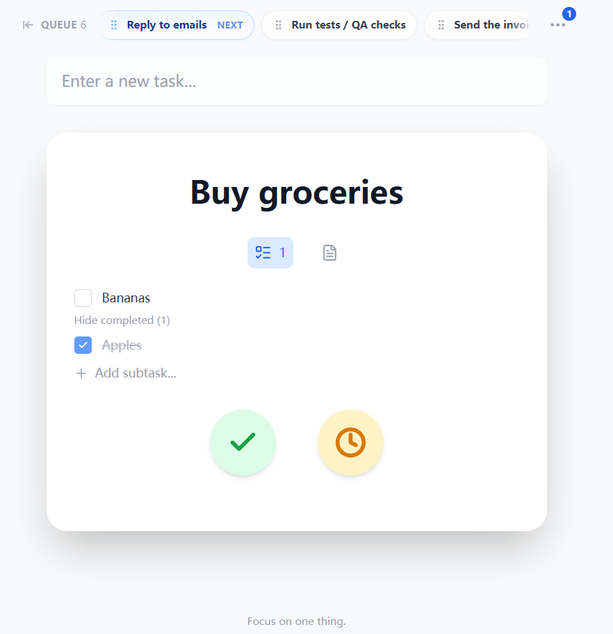

# To Do Or Not To Do

A single-task, round-robin scheduler for your todos. It keeps your attention on **one** current task while everything else waits in a fair ring queue.

Try it now: [to-do-or-not.vercel.app](https://to-do-or-not.vercel.app/)

<!-- Limit screenshot display size -->
<p align="center">
  
</p>

## Highlights

- One-task focus UI
- Round-robin queue: quick rotates the current task to the back
- Defer longer with presets; snoozed tasks wake back into the queue
- Subtasks + Markdown notes per task
- Attachments (local-first; optional cloud sync)
- Undo/redo (Ctrl/Cmd+Z)
- Local-first: persists in `localStorage` + JSON export/import
- Optional: Google sign-in + cloud sync (Firebase Auth + Firestore)

## Core model

- **Add**: new tasks preempt the current one.
- **Complete**: moves the current task to history and loads the next queued one.
- **Defer**: rotate to the back, or snooze until later (pick a duration/date).
- **Simple**: no due date, no priority, no tags, no topics

## Quick start

```bash
npm install
npm run dev
```

## Build

```bash
npm run build
npm run preview
```

## Data & privacy

By default, all data stays in your browser.
If you sign in with Google, the app will also sync your data to the cloud.

### Attachments (optional cloud)

Attachments are stored locally in your browser via IndexedDB (not in `localStorage` / Firestore).
If you're signed in, blobs are uploaded to Firebase Storage and only small metadata is synced to Firestore.

To enable cloud attachments in your Firebase project:

1. Enable **Firebase Storage** (Console → Build → Storage → Get started).
2. Set Storage Security Rules to match the path used by the app: `users/{uid}/attachments/{attachmentId}`.

Example rules (enforces auth + 50 MB per upload):

```text
rules_version = '2';
service firebase.storage {
  match /b/{bucket}/o {
    match /users/{uid}/attachments/{attachmentId} {
      allow read: if request.auth != null && request.auth.uid == uid;
      allow write: if request.auth != null
                   && request.auth.uid == uid
                   && request.resource.size < 50 * 1024 * 1024;
    }
  }
}
```
